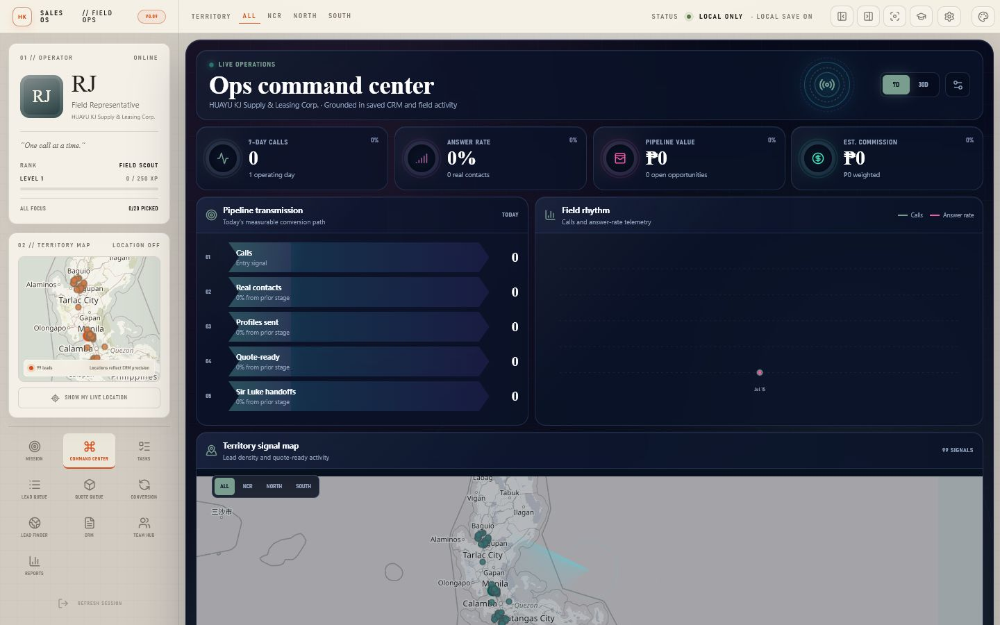

# Sales OS // Ops Command Center v0.09

**Live app:** https://rjpogi02.github.io/sales-os-field-ops/

Sales OS is a local-first, gamified sales and operations cockpit for construction-materials and industrial B2B teams. It combines a lead-aware Conversation Flow, editable CRM, prospect discovery, daily call rosters, follow-up tasks, pricing handoffs, operator progression, role-aware management intelligence, and an optional shared Team Hub without requiring a cloud account for solo use.

v0.09 preserves the working v0.082 call, CRM, Lead Finder, task, report, map, localStorage, and export foundations while expanding Sales OS into an Ops Command Center. The release adds deterministic lead-aware call guidance, one central company/persona configuration, an animated manager dashboard driven by real CRM activity, reviewed CSV/XLSX import, and role-aware Team Hub membership and assignment controls.



## Current deployment status

- **Local mode works without an account.** CRM, operator, daily mission, task, settings, and theme state remain in this browser through `localStorage` until exported or reset.
- **The optional startup PIN is a local device privacy gate, not an online login.** Its salted verifier is stored in the browser and it blocks casual access when a new tab/session starts, but it does not encrypt `localStorage`. Team Hub email/password authentication is separate.
- **Google Places is optional and not preconfigured.** It needs internet access, a Google Maps browser key, the required Google APIs, and billing on the user's Google Cloud project. Usage can incur charges.
- **Team Hub is optional and not preconfigured.** Cross-laptop sync starts only after a Supabase project is configured, the included schema is applied, an operator signs in, joins a company workspace, and completes a successful sync.
- **No Google or Supabase credentials are included in the repository or release package.**
- The Supabase client, merge rules, row-level-security schema, and helper tests are included. The browser-safe connection handshake was verified against a live Supabase project on July 15, 2026; account confirmation and two-laptop collaboration still need the planned operator test before company rollout.
- Sales OS does not automatically call, email, scrape websites, generate final prices, or submit quotations. Final availability and pricing require the human pricing approver configured in Company Profile.

## Start on Windows

1. Install [Node.js LTS](https://nodejs.org) if the launcher says it is missing.
2. Extract the release ZIP completely.
3. Double-click `START_SALES_OS.bat`.
4. Keep the launcher window open while using Sales OS.

The clean release excludes `node_modules`; the launcher installs dependencies on first run.

## Start on macOS

1. Install [Node.js LTS](https://nodejs.org).
2. Extract the macOS release ZIP.
3. Control-click `START_SALES_OS.command`, choose **Open**, and approve it if macOS asks.
4. Keep Terminal open while using Sales OS.

If extraction removed the executable flag, run `chmod +x START_SALES_OS.command` once.

## Developer commands

```bash
npm install
npm run dev
npm test
npm run build
npm run preview
```

`npm run dev` and `npm run preview` listen on the local network as configured by Vite. Use an appropriate firewall and do not expose an unreviewed development server to the public internet.

## What is new in v0.09

### Lead-aware Conversation Flow

- Replaced the fixed Coach script with a deterministic Flow that responds to lead status, buyer vertical, captured needs, and recent objections.
- Keeps openings short, uses only verified company differentiators, frames the company as a dependable primary or backup supplier, and ends each branch with one small next step.
- Shows the operator why each line is being suggested and never presents generated language as a completed action.
- Preserves the existing call checklist, quick results, send pack, activity log, CRM updates, and human-controlled pricing handoff.

### Central company and persona configuration

- Added one normalized Company Profile for company name, short call name, business vertical, operator identity, final pricing approver, fleet, assets, quarry/source locations, materials, and verified credentials.
- Added a Company Profile editor in Settings so scripts, reports, pricing queues, send packs, and dashboard labels use the configured facts instead of scattered hardcoded names.
- Default HUAYU data is limited to verified context: 27 dump trucks plus tractor heads, with quarry operations in Rodriguez, Rizal and Tarlac.
- Existing local data and legacy pricing fields migrate forward without discarding the operator's CRM history.

### Animated Ops Command Center

- Added a Command workspace with live 7-day/30-day controls, calls, answer rate, open pipeline value, estimated commission, conversion funnel, activity trend, territory signals, objection intelligence, team state, and opportunity rollup.
- Uses real local CRM and call-event data; no fictional coworkers or fabricated performance are inserted when Team Hub is not connected.
- Adds a restrained JARVIS-inspired motion system: ambient grid and scan, signal core, animated KPI rings, chart traces, funnel transmission, radar sweep, staggered panels, and panel highlights.
- Maintains a dense work-focused layout, supports phone widths without horizontal overflow, and honors `prefers-reduced-motion`.
- Manager intelligence remains descriptive and rule-based. It recommends what to inspect next but cannot change lead status, prices, assignments, or CRM records.

### Reviewed CSV/XLSX CRM import

- Imports `.csv` and `.xlsx` files through a staged workflow: parse, five-row preview, column mapping, validation, deduplication, and final summary.
- Maps common CRM headings automatically while keeping the operator in control of corrections before import.
- Routes rows missing required callable data into Research instead of silently placing them in the daily queue.
- Defaults imported records to private/local scope; team sharing is an explicit choice.
- Dedupes against existing CRM data and within the same uploaded file before committing changes.

### Role-aware Team Hub foundation

- Adds owner, manager, and representative roles with pending/approved membership states, open or approval-required joining, and operator assignment metadata.
- Gates manager-only Command Center data when an authenticated Team Hub identity is present; local solo mode keeps the current operator's own command view available.
- Preserves atomic call claims, same-day teammate exclusion, private records, deterministic merge behavior, and row-level-security boundaries.
- Includes `supabase/migrations/20260715_v009_team_roles.sql` for existing Team Hub projects. Live two-device deployment still requires a user-owned Supabase project and production-like testing.

### Verification

- `npm test`: 72 tests pass.
- `npm run build`: production build passes; Vite still reports a non-blocking large-main-chunk warning.
- Rendered QA passed at 1440x900 and 390x844 with zero horizontal overflow, working 7/30-day switching, corrected map bounds, and no browser console warnings or errors.
- See [QA_V009.md](QA_V009.md) for the exact test boundary and pre-deployment checklist.

## v0.082 foundation retained in v0.09

### Guided startup and local privacy

- A six-stage startup setup collects the operator identity, daily call goal, territory, optional device PIN, Lead Finder provider, and optional Team Hub connection fields before the first real session.
- Google Places keys can be checked with one explicit test lookup during setup. No test runs automatically, and no key ships with Sales OS.
- Team setup can be staged during onboarding, but it remains local-only until the Supabase schema is applied, the operator signs in, joins a workspace, and completes a successful sync.
- The optional 4-8 digit startup PIN is derived into a salted PBKDF2 verifier. It is not stored as readable text, but it is only a browser privacy gate—not file encryption, a recovery service, or a Team Hub account.
- Settings can lock the current session immediately, disable the PIN while unlocked, or reopen startup setup.

### Lead Finder campaigns

- Search several business types across several cities or provinces in one reviewed campaign.
- Add custom business or supplier phrases beside the built-in target chips, so a campaign can look for a specific kind of buyer, supplier, contractor, or facility.
- Choose a target of 20, 40, 60, or 100 candidates. A target is a cap, not a guaranteed result count.
- Review separate **Callable**, **Needs research**, and **Already in CRM** lanes before importing anything.
- See source provenance, address, phone, website, operating status, completeness score, and external verification shortcuts.
- Dedupe by provider place ID, normalized phone, website domain plus branch/address, email, and branch fingerprint while preserving legitimate same-company branches in different locations.
- Approve a lead for the CRM, send it to Research, or add a callable result directly through queue eligibility.
- Import approved leads as **company team** or **private to me**. Private imports stay local and are not pushed to Team Hub.
- Cache matching campaign results for seven days; **Refresh** explicitly requests new provider data. Successful partial results remain visible if a later campaign lookup fails.
- Persist the active campaign, review lane, custom terms, selected candidates, results, and completion message. Leaving Lead Finder and returning no longer repeats a paid provider search.
- Reward only newly imported, approved candidates: 5 career XP per unique fingerprint, capped at 10 rewarded leads / 50 XP per import. The persistent reward ledger prevents deleting and re-importing the same candidate to farm XP; Practice Mode awards none.

#### Google Places provider

Google Places is the multi-area campaign provider. The app uses client-side Maps JavaScript Places text search and requests business identity, address, coordinates, phone, website, Maps URL, and operating status. Google Places does not provide business email in this workflow, so email remains a research step.

To configure it:

1. Create or choose a Google Cloud project and enable the Maps JavaScript API and the applicable Places API.
2. Create a **browser key** and add website/HTTP-referrer restrictions for the addresses that will run Sales OS.
3. Add API restrictions so the key can call only the APIs required by this app.
4. In Sales OS startup setup or **Settings → Lead Search**, select Google Places and paste the restricted browser key.
5. Test a small campaign and monitor quotas and billing before wider use.

The key is stored locally in the active browser profile. Never use an unrestricted key. See Google's [Places search documentation](https://developers.google.com/maps/documentation/javascript/place-search) and [API security guidance](https://developers.google.com/maps/api-security-best-practices).

#### OpenStreetMap fallback

The OpenStreetMap/Nominatim option deliberately performs one user-triggered, low-volume lookup from the first campaign job. It is a manual fallback, not a bulk lead source. Results may omit phone, email, website, or operating status and must be verified before outreach. Do not use the public Nominatim service for systematic POI harvesting; follow its [usage policy](https://operations.osmfoundation.org/policies/nominatim/) and keep OpenStreetMap attribution visible.

### Daily roster and safe auto-pick

- Set a personal daily call goal from 1 to 50 in Settings or the queue planner.
- Locking a roster snapshots that day's target and lead IDs so the mission remains stable while calls are completed.
- Completing a call removes the lead from **Ready today**, keeps it in **Completed today** and the CRM, and prevents auto-pick from choosing it again that day.
- Auto-pick also excludes contacts already called today by a synced teammate and dedupes matching phone numbers.
- One centralized eligibility rule is used by auto-pick, manual selection, Lead Finder's **Add + Pick**, and the visible queue.
- The queue excludes the wrong territory, missing/invalid numbers, Research leads, wrong numbers, completed or contacted-today leads, conversion/pricing stages, scheduled follow-ups, future retries, another operator's private leads, and active teammate claims.
- **Wrong Number** moves a lead to Research. It cannot re-enter auto-pick until a different valid phone is entered and its verification state is set to **Verified**.
- Direct follow-up calls from the Conversion Desk remain available when the operator intentionally chooses them.

### Tasks beyond calls

- Add follow-up, quotation, sample, delivery, admin, or general work from the new **Tasks** workspace.
- Set due date, category, priority, assignee, private/team visibility, and an optional linked CRM lead.
- Filter Today, Upcoming, and Completed; edit, complete, reopen, or delete tasks in place.
- Accept task suggestions built from CRM follow-up, pricing, sample, and quotation dates.
- Completing a task awards small priority-based work XP (low 4, medium 6, high 9, urgent 12, plus 2 for team-visible work), with a 60-XP daily cap.
- Each task stores an immutable XP receipt. Reopening and completing it again does not award more XP, and reaching the cap still records the task as completed.
- Connected Team Hub members appear in the assignee list, allowing an admin or coworker to assign team-visible work to another signed-in operator. Private tasks remain device-local.
- Team-visible tasks sync only after Team Hub is connected; private tasks stay on the current device.

### Historical performance

- Reports now keep up to 120 local daily/operator snapshots instead of showing only the current day.
- Browse recent days, compare calls, answers, answer rate, profiles, quote-ready leads, and XP, and inspect the recorded call-result list for the selected date.
- A seven-day bar view and funnel-aware advice make improvement visible without changing permanent CRM history.

### Optional Team Hub

- Email/password sign-up and sign-in through a user-supplied Supabase project.
- Create a company workspace or join one with an invite code.
- Sync shared leads, team tasks, operator profiles, and call events across laptops.
- Atomic lead claims prevent two connected operators from intentionally claiming the same shared lead at the same time; claims expire and can be released.
- Every shared-lead Call Mode entry—including direct, next-lead, and restored sessions—revalidates the server claim before opening. A denied claim stays closed locally.
- Same-day teammate call events are checked with the claim, call events use stable UUIDs for idempotent retries, and events publish before claims are released.
- Auth sessions refresh before expiry and retry one request after an unauthorized response; local operator IDs are never written into UUID ownership fields.
- Synced teammate call events keep already-contacted leads out of another operator's daily auto-pick.
- Company imports from Lead Finder can be shared; private imports remain local.
- Cloud leaderboard scores calls, real contacts, profiles sent, quote-ready outcomes, and pricing handoffs. The local report leaderboard remains explicitly limited to this device.
- Connected sessions refresh the team snapshot periodically while the app is visible, and **Sync team now** is available for an explicit refresh.

#### Configure Team Hub

1. Create a Supabase project.
2. Open its SQL editor and run `supabase/schema.sql` once. Review the SQL for your organization's policies before applying it.
   - Existing v0.08 Team Hubs must also run `supabase/migrations/20260714_team_call_claim_reliability.sql` so stale/direct Call Mode launches honor same-day teammate activity and claim acquisition is reported explicitly.
   - Existing Team Hubs upgrading to v0.09 must then run `supabase/migrations/20260715_v009_team_roles.sql` for roles, approval state, join policy, and assignment metadata.
3. Configure the desired email authentication behavior in Supabase Auth.
4. Copy the project URL and the browser-safe **anon/publishable key**. Never paste a service-role key into Sales OS.
5. Open **Team Hub**, save the connection, then create or sign in to an operator account.
6. Create the company workspace on the first laptop and share its invite code with coworkers, or join an existing workspace.
7. Select **Sync team now** and confirm the status says **Connected & synced** before relying on cross-laptop claims or queue exclusion.
8. Test two non-production accounts on two laptops before importing company data.

The included schema creates organizations, memberships, profiles, team leads, lead claims, call events, and team tasks. It enables row-level security and uses authenticated organization membership for access. Supabase configuration and session data are stored locally; passwords stay only in the sign-in form/request flow. Sign out when using a shared device. See the [Supabase Auth](https://supabase.com/docs/guides/auth), [REST API](https://supabase.com/docs/guides/api), and [row-level security](https://supabase.com/docs/guides/database/postgres/row-level-security) guides.

### Themes and Call Mode

- Seven workspace themes: Light, Dark, Liquid Glass, Frosted Glass, **Aurora Glass Ops**, Rose Quartz, and Velvet Orchid.
- Call Mode matches the workspace by default or can keep an independent theme override.
- Aurora Glass Ops is a calm dark-glass operations theme with cyan, blue, and violet signals, restrained ambient motion, dense readable cards, and a matching Call Mode treatment.
- Rose Quartz provides a warm blush glass cockpit; Velvet Orchid provides a darker plum/lilac cockpit.
- The long theme dropdown is replaced by a compact, keyboard-accessible visual swatch palette.
- Native selects now use a consistent theme-aware surface, border, focus ring, and custom chevron instead of the browser's old default styling.
- Theme-aware fields, scrollbars, pulse effects, surfaces, and contrast extend into Call Mode, with reduced-motion behavior preserved.

## Recommended operating loop

1. Export the CRM CSV before a real session.
2. Select the active operator, territory, and daily call target.
3. Use Lead Finder to build a reviewed candidate pool; research missing contacts before queueing them.
   - Reopen another workspace and return to Lead Finder to continue the saved review instead of searching again. Use **Refresh** only when new provider data is intentional.
4. If Team Hub is enabled, confirm **Connected & synced** before auto-picking.
5. Lock the roster and record one quick result after every call.
6. Complete the answered-call checkpoint, send the profile, capture pricing facts, and schedule the next touch.
7. Move serious opportunities to the configured final pricing approver and copy the structured handoff.
8. Plan non-call work in Tasks.
9. Generate the daily report and export the updated CRM CSV.

## Local data and safety

- Browser storage is not a substitute for a managed database or backup. Export the CRM regularly.
- The device PIN does not encrypt browser data. Anyone with access to the browser profile or developer tools may still be able to read local application storage.
- A factory reset removes local application data from that browser. Export first.
- Practice Mode keeps a restoration backup; exit Practice Mode before exporting a real report.
- Demo Mode blurs common contact surfaces for presentations, but it is not encryption.
- Public listings, operating status, coordinates, and phone numbers can be incomplete or stale. Review every candidate before calling.
- Respect provider terms, privacy rules, consent requirements, and applicable anti-spam/telemarketing laws.
- `tel:` and `mailto:` actions use the device's configured apps; Sales OS does not place calls or send mail itself.
- Map and distance data are planning aids. Confirm delivery feasibility and supplier availability with management.
